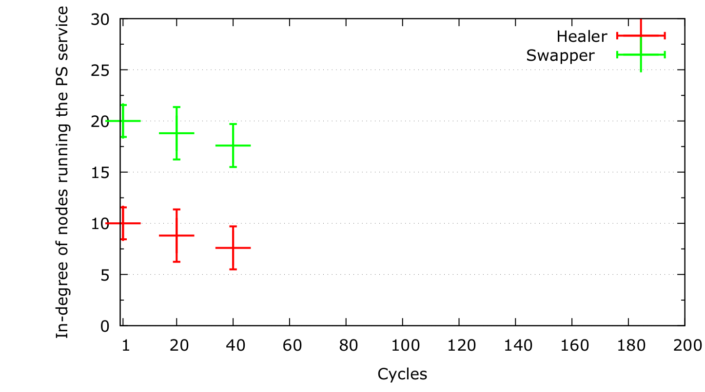

# :bar_chart: Plotting the convergence behavior of the PS service

The following command creates a Docker container with [Gnuplot](https://hub.docker.com/r/remuslazar/gnuplot/) that executes the script `plot_indegree_per_cycle.gp`.

``` bash
docker run --rm -v $(pwd):/work remuslazar/gnuplot plot_indegree_per_cycle.gp
```

The files with the `data` extension are examples of how you can report your results. Simply, follow the format in this file to get a plot similar to the one shown below.


